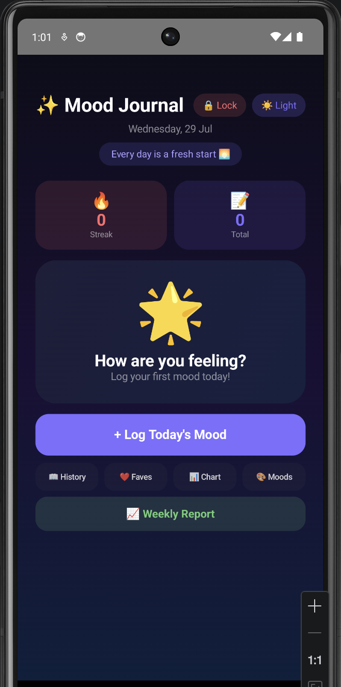
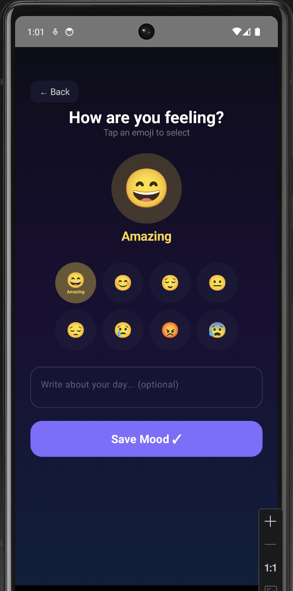
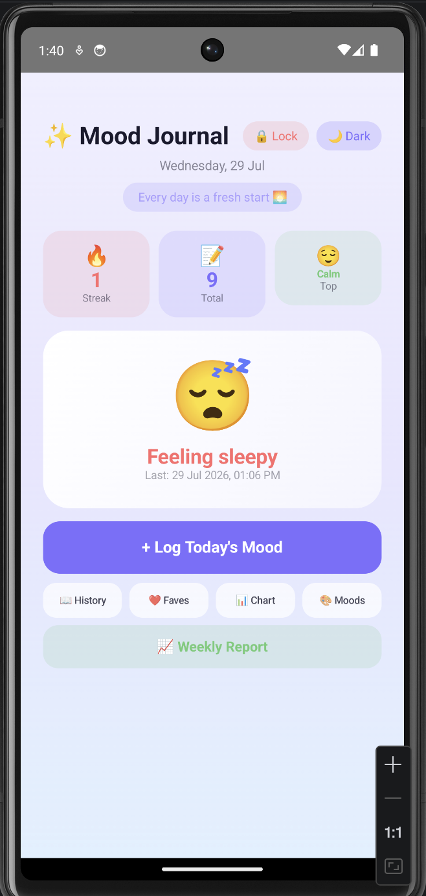

# 😊 Mood Journal — Personal Mood Tracker

A beautiful and secure personal mood tracking Android app built with Kotlin and Jetpack Compose. Features PIN lock security, dark/light mode, mood streak counter, weekly chart, favorites, custom moods, weekly report, PDF export, and daily reminders.

## Author

Yasmeen Azmat Ali
MSc Artificial Intelligence
University of West London

---

## Project Overview

Mood Journal is a fully-featured Android app that helps users track their daily emotional wellbeing. Users can log their mood with emojis, add personal notes, view their mood history, and analyze patterns through an interactive chart — all secured behind a PIN lock. The app also sends daily reminders and generates weekly PDF reports.

---

## Features

- 🔐 PIN lock — secure your personal journal
- 🌙 Dark & Light mode toggle
- 🔥 Streak counter — tracks consecutive daily logging
- 📊 Mood chart — visual breakdown of all logged moods
- ❤️ Favorites — bookmark special mood entries
- 🎨 Custom moods — add your own emoji, name, and color
- 💬 Daily motivational quotes
- 📝 Notes — add personal notes to each mood entry
- 📖 History screen — view all past mood entries
- 📈 Weekly report — mood breakdown for last 7 days
- 📄 Export as PDF — save weekly report as PDF file
- 🔔 Daily reminder notification — logs mood at 8 PM

---

## Screenshots

### 🏠 Home Screen
Dashboard showing today's mood, streak counter, total logs, and top mood stats.



### ➕ Log Mood Screen
Choose from 8 default emoji moods or custom moods. Add an optional note before saving.



### 📖 History Screen
All past mood entries with color-coded cards. Tap heart to save favorites.


### ❤️ Favorites Screen
All bookmarked mood entries in one place.


### 📊 Mood Chart Screen
Visual bar chart showing how many times each mood was logged.


### 🎨 Custom Moods Screen
Add your own moods with a custom emoji, name, and color.


### 🔐 PIN Lock Screen
Secure your journal with a 4-digit PIN. Set up on first launch.


### ☀️ Light Mode
Full light mode support — toggle anytime from the home screen.



### 📈 Weekly Report
Mood breakdown for last 7 days with stats and PDF export button.


---

## Technologies Used

- Kotlin
- Jetpack Compose
- Material Design 3
- Android Studio
- WorkManager — daily notifications
- iTextPDF — PDF export
- State Management with remember & mutableStateOf
- LazyColumn for efficient list rendering
- Infinite animations with rememberInfiniteTransition

---

## Getting Started

### 1. Clone the repository
```
git clone https://github.com/yasmeenmh90-beep/MoodJournal.git
cd MoodJournal
```

### 2. Open in Android Studio

- Open Android Studio
- Click **File → Open**
- Select the MoodJournal folder

### 3. Run the app

- Connect an Android device or start an emulator
- Click the green **▶ Run** button

### 4. Minimum Requirements

- Android API 24 (Android 7.0) or higher
- Android Studio Hedgehog or newer

---

## App Structure
```
MoodJournal/
├── app/src/main/java/com/example/moodjournal/
│   └── MainActivity.kt        # All screens and logic
├── app/src/main/res/
│   ├── drawable/              # App icons
│   └── values/                # Colors, strings, themes
└── build.gradle.kts           # Dependencies
```

---

## Key Screens

| Screen | Description |
|---|---|
| PIN Setup | First launch — create 4-digit PIN |
| PIN Lock | Every launch — enter PIN to unlock |
| Home | Dashboard with streak, stats, last mood |
| Log Mood | Select emoji, add note, save entry |
| History | All entries with favorite toggle |
| Favorites | Bookmarked entries |
| Chart | Bar chart mood breakdown |
| Custom Moods | Add/delete custom moods |
| Weekly Report | Last 7 days stats + PDF export |

---

## Future Work

- Room database — persist data after app restart
- Online backup with Firebase
- Home screen widget
- Mood sharing feature
- More themes and color options

---

## License

This project is for portfolio purposes.
